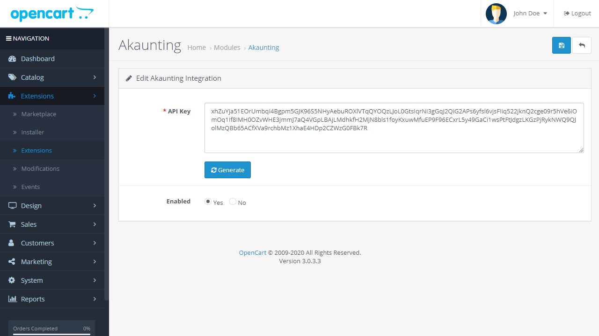
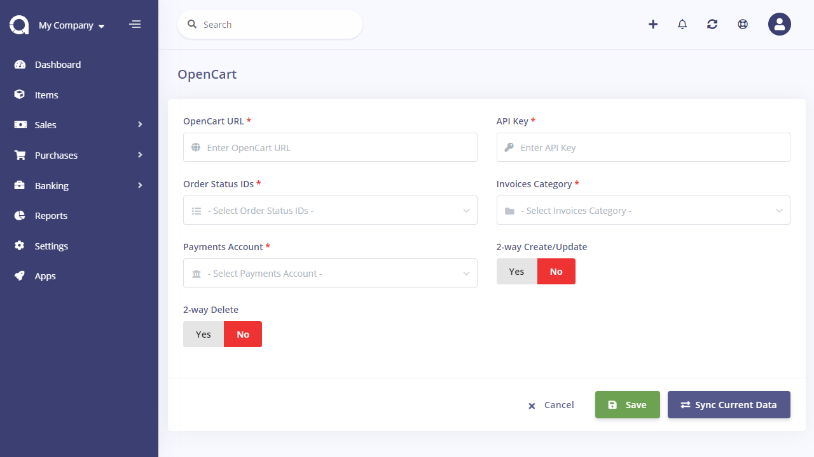

OpenCart
========

This app will sync your current and future OpenCart data (categories, products (items), customers, tax rates, orders) with Akaunting.

Keep in mind that both OpenCart [extension](https://www.opencart.com/index.php?route=marketplace/extension/info&extension_id=32533) and Akaunting [app](https://akaunting.com/apps/opencart) are required in order to have the 2 system talk to each other.

### 1) OpenCart Extension Installation

First of all, after downloding the extension, install it by uploading from *Extensions > Installer* page of your OpenCart. You can also unzip and upload via FTP.

### 2) OpenCart Extension Settings

After installation, go to *Extensions > Extensions* page and filter Modules. In the Akaunting edit page you'll find the API Key to be copy-pasted.

### 3) Akaunting App Settings

Akaunting app will get and send data automatically between Akaunting and OpenCart. In order to get the current data after first installation, you can click on the Sync with OpenCart button. It's not required for future data.

**OpenCart URL**: The full path of your OpenCart installation without wp-admin or wp-login parts. For example: https://my-opencart-domain.com

**API Key**: Generated in the previous step

**Order Status IDs**: The status ids that OpenCart order should have in order to get transferred to Akaunting.

**Invoices Category**: The category that invoices will be assigned to.

**Payments Account**: The bank account that payments will be attached to.

**2-way Create/Update**: Select whether to sync the *create* and *update* actions between Akaunting and OpenCart for categories, products (items), tax rates, and orders. In other words, when a product is created/updated in OpenCart, it will also be created/updated in Akaunting, automatically. Same for vice-versa.

**2-way Delete**: Select whether to sync the *delete* action between Akaunting and OpenCart for categories, products (items), tax rates, and orders. In other words, when a product is deleted in OpenCart, it will also be deleted in Akaunting, automatically. Same for vice-versa.

