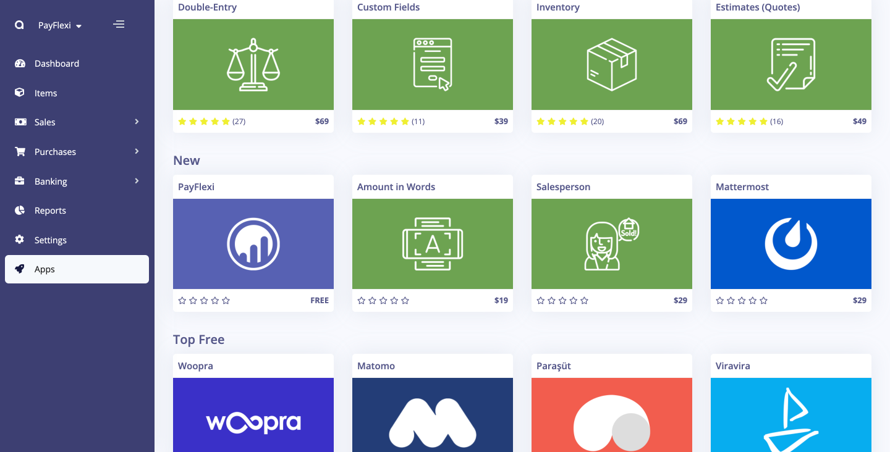
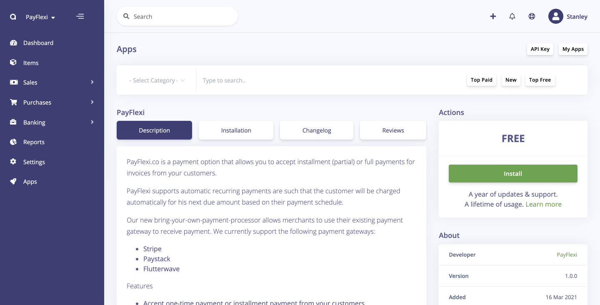
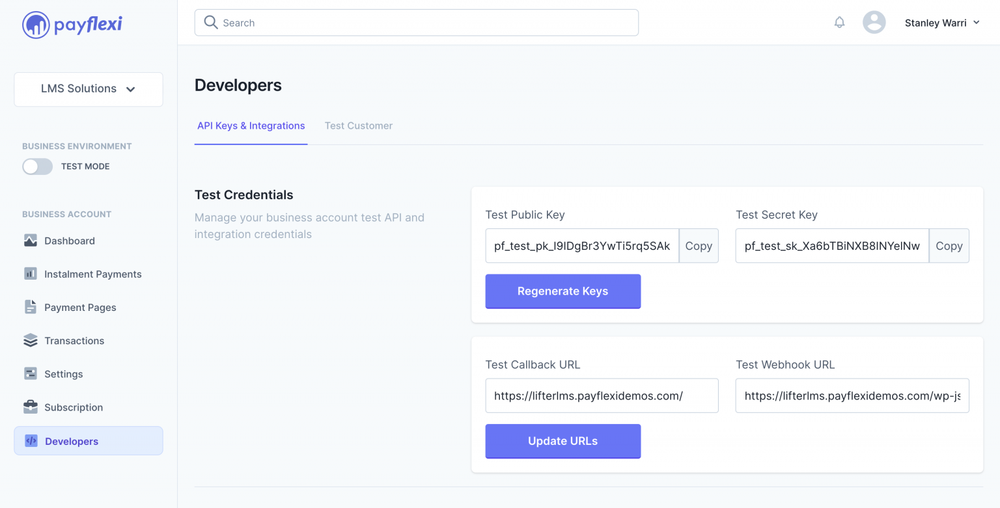
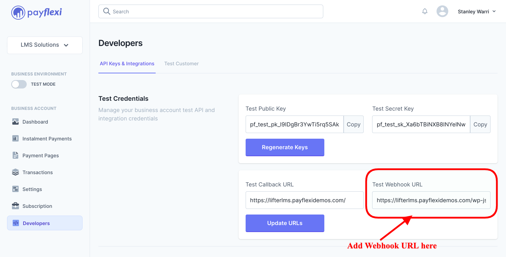
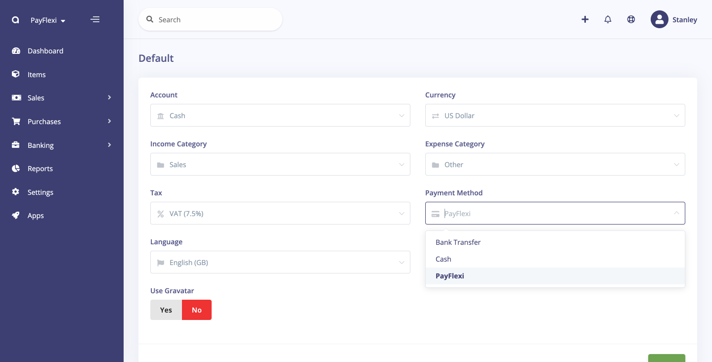
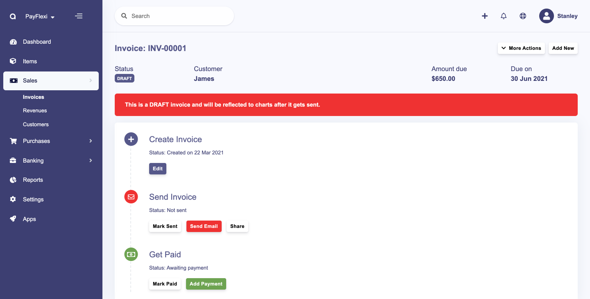
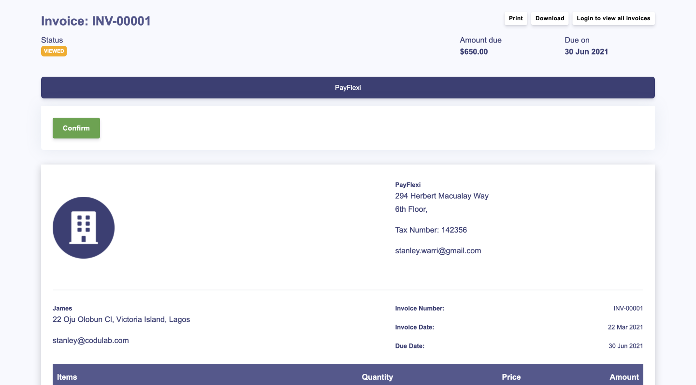
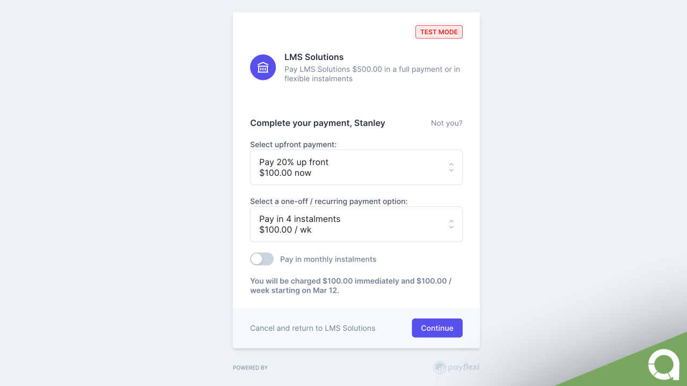

PayFlexi
========

> [PayFlexi](https://payflexi.co) is a payment method that allows businesses to accept instalment (partial) or full payments for invoices from their customers.

PayFlexi supports automatic recurring payments such that the customer will be charged automatically for the next due amount based on their payment plans.

Our new bring-your-own-payment-processor allows businesses to use their existing payment gateway to receive payment. PayFlexi currently support the following payment gateways:

__[Stripe](https://stripe.com)__
__[Paystack](https://paystack.com)__
__[Flutterwave](https://flutterwave.com)__

## Installation

To integrate PayFlexi with Akaunting, sign up for a free cloud account on [Akaunting](https://akaunting.com/dashboard)

After setting up the account, click on Apps menu and search for PayFlexi. To learn more on how to set up your Akaunting dashboard, click [here](https://akaunting.com/docs/user-manual/dashboard)

Click on the “PayFlexi” card to view and then click on the “Install” button

## Settings

After installing, click on the **Settings** menu and click on **PayFlexi** card

* __Test Secret API Key__ – Enter PayFlexi Test Secret Key here. Get the API key from your PayFlexi Merchant Account under Developer > API
* __Test Public API Key__ – Enter PayFlexi Test Public Key here. Get the API key from your PayFlexi Merchant Account under Developer > API
* __Live Secret API Key__ – Enter PayFlexi Live Secret Key here. Get the API key from your PayFlexi Merchant Account under Developer > API
* __Live Public API Key__ – Enter PayFlexi Live Public Key here. Get the API key from your PayFlexi Merchant Account under Developer > API
* __Webhook URL__ – This is automatically generated for each Akaunting account. Copy it and add it to the webhook url field on your PayFlexi merchant dashbaord.

Next, add the API keys from your PayFlexi merchant dashboard.  If you don’t have a merchant account, you can register for a merchant account by clicking [here](https://merchant.payflexi.co/)

Then navigate to **Developers > API Keys** menu on the PayFlexi dashboard. Copy the keys from this page to the **Akaunting > PayFlexi > Settings** page

### Setup Webhook URL

<strong>Set the Webhook URL in the [API Keys & Webhooks](https://merchant.payflexi.co/developers?tab=api-keys-integrations) settings page in your PayFlexi Merchant Account</strong>

Copy the Webhook URL from the **Akaunting > PayFlexi > Settings** page.

Click on __Save__ once done.

## General Configuration

Under the **Akaunting > Settings** page, click on the **Default** card and select **PayFlexi** as the default payment method.

After creating an invoice, click on **Send Email** to send it to the customer for payment

The customer will receive an email with a link to make payment.

On clicking **Confirm**, it redirects the customer to PayFlexi to set up their payment plans.

### Useful Resources

* Learn how to connect your Stripe account with PayFlexi - [Click Here](https://support.payflexi.co/collections/how-to-connect-your-stripe-account/)

* Learn  how to test your integration by following this instruction [here](https://support.payflexi.co/collections/how-to-test-payments-on-payflexi/)

