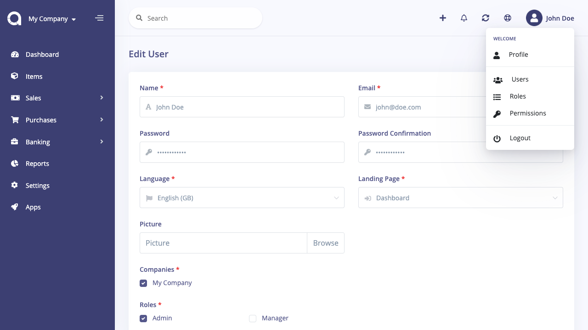

Permissions
===========

Akaunting provides a powerful ACL system thanks to the wonderful [Laratrust](https://github.com/santigarcor/laratrust) package for Laravel. It ships with very useful functions to be used on both PHP and Blade templates.

Akaunting adds even more power to Laratrust with an easy to use interface to manage all Users, Roles and Permissions.



Furthermore, all these permissions and roles are also applicable to RESTful API access so you can create an API user account that can just read but not write data to your Akaunting.

### Checking for permissions

It's so simple to check for roles and permissions:

```php
$user->hasRole('admin');
$user->hasRole('customer');
$user->can('update-auth-users');
$user->can('create-settings-categories');
```

```
@permission('update-auth-users')
    <p>This is visible to users with the given permissions.</p>
@endpermission
```

Laratrust's [documentation](http://laratrust.readthedocs.io/en/5.0/usage/concepts.html#checking-for-roles-permissions) has more details about how to check for roles and permissions.

### More

[Here](http://laratrust.readthedocs.io/en/5.0) you can find the Laratrust documentation to learn more about.
