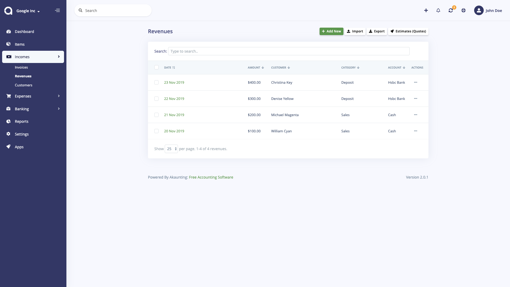
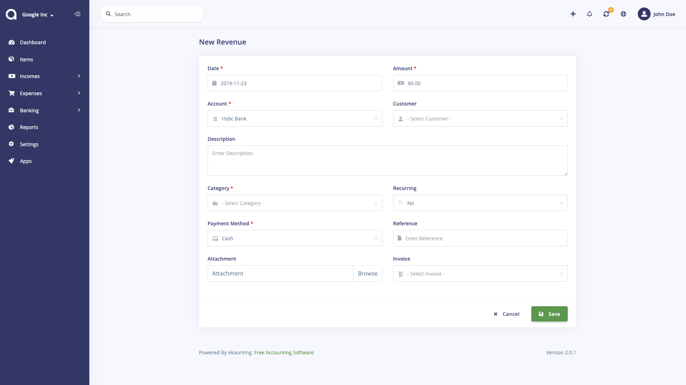

Revenues	
========

Revenue is a non-invoiceable and paid income. You can also record the money deposits from the revenues page. Check out [this page](https://akaunting.com/docs/faq/invoices-vs-revenues) for the difference between invoices and revenues.

Revenues page is located under **Incomes > Revenues** menu. On this page you can see all revenues, search/filter for any, create a new one, edit the current ones and delete them.

The following fields are displayed:

- **Date**: Paid date.
- **Amount**: Amount of the revenue.
- **Customer**: Who paid the revenue.
- **Category**: Category of the revenue.
- **Account**: Account paid to.
- **Actions**: You can use this button to edit, duplicate, and delete the revenue.

## New Revenue

The following fields are displayed as blank to be filled, some are required and some not. Those marked with red star are required.

- **Date**: Paid date.
- **Amount**: Amount of the revenue.
- **Account**: Account paid to.
- **Description**: Custom description for the revenue.
- **Category**: Category of the revenue to be used in reports.
- **Recurring**: Automatically create revenues for ongoing jobs. Times=0 means infinite. Don't forget to set the *Cron Command* available at *Settings > [Scheduling](https://akaunting.com/docs/user-manual/settings/scheduling)*.
- **Customer**: Who paid the revenue.
- **Payment Method**: Method used to pay the revenue.
- **Reference**: Any possible reference.
- **Attachment**: You can attach file related to the revenue.
- **Invoice**: You can attach the payment to a invoice.

