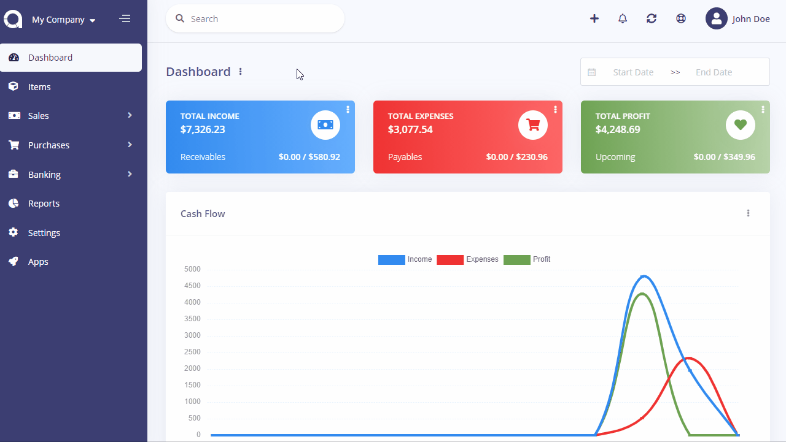

Payments
========

Payment is a paid expense transaction. It can be an independent record (i.e. food receipt) or attached to a bill. There are no items within the payments. Tax is not applicable.

Payments page is located under **Purchases > Payments** menu and the following fields are displayed:

- **Date**: Paid date.
- **Amount**: Amount of the payment.
- **Vendor**: To whom made the payment.
- **Category**: Category of the payment.
- **Account**: Account used to pay.
- **Actions**: You can use this button to edit, duplicate, and delete the payment.

## New Payment

The following feilds are displayed as blank to be filled, some are required and some not. Those marked with red star are required.

- **Date**: Paid date.
- **Amount**: Amount of the payment.
- **Account**: Account used to pay.
- **Description**: Custom description for the payment.
- **Category**: Category of the payment to be used in reports.
- **Recurring**: Automatically create payments for ongoing jobs. Times=0 means infinite. Don't forget to set the *Cron Command* available at *Settings > [Scheduling](https://akaunting.com/docs/user-manual/settings/scheduling)*.
- **Vendor**: To whom made the payment.
- **Payment Method**: Method used to pay.
- **Reference**: Any possible reference.
- **Attachment**: You can attach file related to the payment.
- **Bill**: You can attach the payment to a bill.

